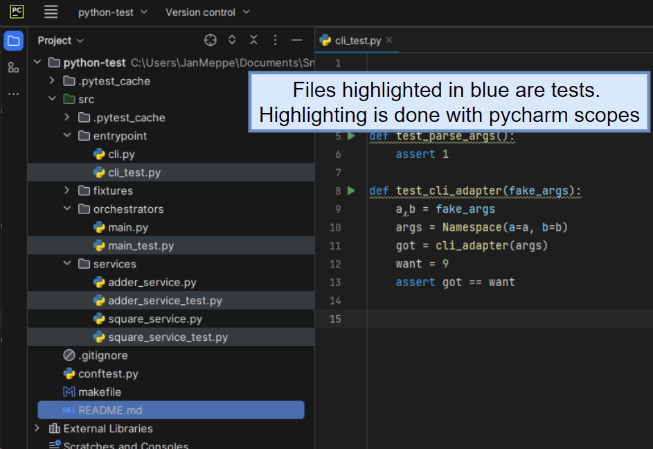

# Should we colocate our tests? A proof-of-concept 

## What is colocating?

Usually we put our source code and tests in different folders, `src/` and `tests/`
respectively. **Colocating** the source code and test code means putting them next to each
other. This repository is a small exploratory proof of concept to illustrate.

Instead of having `src/main.py` and `test/test_main.py` we now have `src/main.py` and `src/main_test.py`.

## Tests

Run the unit tests (fast)

```bash
make test
```

Run all tests (slow)

```bash
make test-full
```

## Usage

```bash
make run
```


## Why would we colocate our source and test code?

Different programming languages and ecosystems often have their own conventions and best
practices for organizing code. The practice of colocating source and test code, as seen in
Go (Golang), is indeed a valid approach and has its own advantages.

Here are some reasons why colocating source and test code might be preferred:

1. **Simplicity and Readability:** Having source and test files in the same directory can
   make it simpler and more readable, especially for smaller projects. Developers can
   easily locate and understand the relationship between source and test files.

2. **Less Navigation:** Colocating source and test files reduces the need for directory
   navigation. Developers can quickly locate and open both source and test files for a
   specific package without traversing different directory levels. This streamlined
   approach contributes to a more straightforward development experience, especially for
   smaller projects or when working with languages that embrace a flat directory structure
   for source and test files.

3. **(!!) Elevation of Testing Code:** Colocating source and test files elevates the importance
   of testing code to be on par with source code. Placing tests in close proximity to the
   source code emphasizes the significance of thorough testing, making it more likely that
   developers will prioritize and maintain the testing suite.

**I believe that number 3 is the most important one**. By colocating our test and source code we
elevate testing code from a mere afterthought (admit it) to a first-class citizen of the
project.

## Pycharm has editor support

Pycharm actually has great editor support for this. You can highlight the test files in
blue which makes for a visually appealing developer experience.

